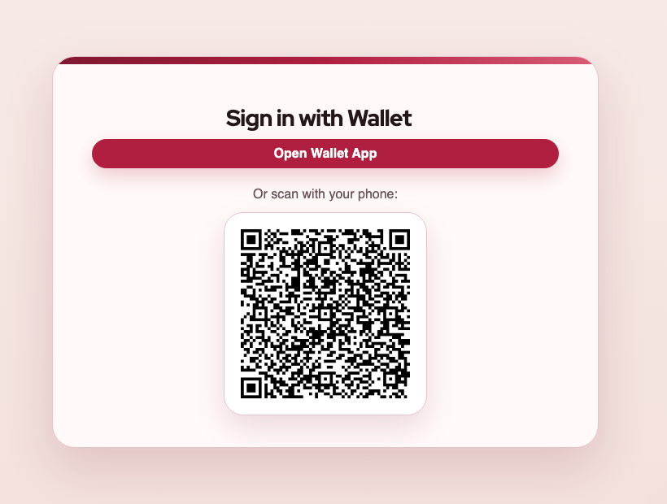

# eudi-wallet-connector

> [!WARNING]
> This repository is not production-ready. The default configuration is for demos and must be adjusted before real deployment, for example the default `wallet-rp` client currently allows unrestricted redirect URIs and web origins.

Configuration-only Keycloak distribution that turns a Keycloak instance into an OAuth/OIDC-facing connector for EUDI wallets.



It uses the `de.arbeitsagentur.opdt:keycloak-extension-oid4vp` provider and includes:

- a realm import for a German PID-focused wallet connector
- transient-user configuration (`doNotStoreUsers=true`) so no brokered users are persisted
- session-note mapping from wallet claims to `id_token` and `userinfo`
- a default OIDC client for relying-party testing
- local Docker Compose startup and a `scripts/dev.sh` workflow for the German SPRIND sandbox testing environment and `oid4vc-dev`
- documentation for configuration and theming

## Quick Start

Download the provider jar and generate the default local-wallet realm:

```bash
scripts/prepare-providers.sh
scripts/setup-local-realm.sh --local-wallet
docker compose up
```

The provider jar is downloaded through Maven using [pom.xml](pom.xml). The artifact still must be available in your configured Maven repositories.

Or use the one-command workflow:

```bash
scripts/dev.sh --local-wallet
```

If `oid4vc-dev` is not already installed, local-wallet mode installs it into `target/bin/` with `go install` using the version from [tools/go.mod](tools/go.mod).

Once Keycloak is up:

- Keycloak: `http://localhost:8080`
- Admin Console: `http://localhost:8080/admin`
- Realm: `wallet-connector`
- Test client: `wallet-rp`

Interactive OIDC smoke test:

```bash
scripts/test-oidc-flow.sh --base-url http://localhost:8080
```

The helper reads OIDC discovery from `--base-url` and uses the browser-facing hostname published by Keycloak. This lets the same command work for localhost-only and ngrok-based setups.

Example authorization request:

```text
http://localhost:8080/realms/wallet-connector/protocol/openid-connect/auth?client_id=wallet-rp&redirect_uri=http%3A%2F%2Flocalhost%3A8081%2Fcallback&response_type=code&scope=openid%20wallet-pid&code_challenge=challenge&code_challenge_method=S256
```

The default browser flow auto-selects the PID provider alias `eudi-pid`.
The browser flow only redirects to the wallet provider, so each login starts a fresh wallet flow instead of reusing a Keycloak login cookie.
If you add more OID4VP identity providers, use `kc_idp_hint=<alias>` to choose one.

## Documentation

- [Configuration](docs/configuration.md)
- [OID4VP Provider](docs/oid4vp-provider.md)
- [Development](docs/development.md)
- [Theming](docs/theming.md)

## License

Apache License 2.0. See [LICENSE](LICENSE).
